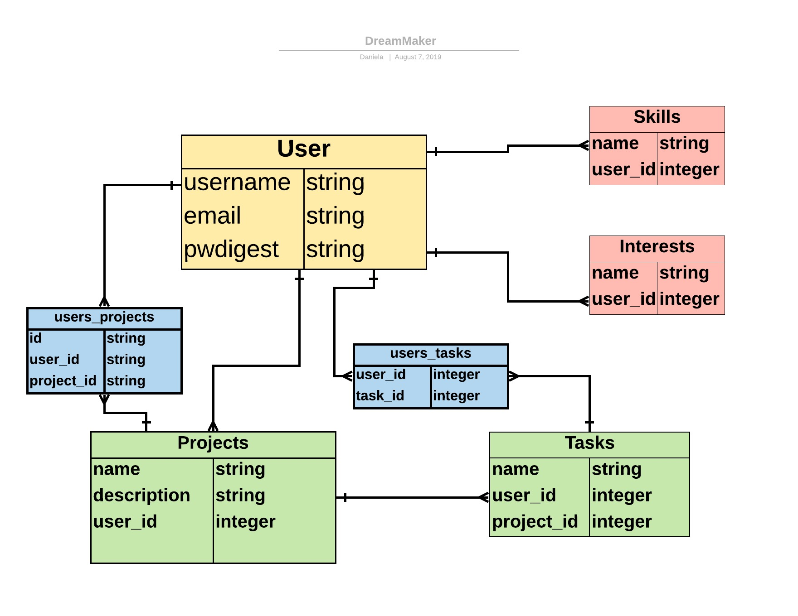

# OHN

### Project Overview:

A web app that connects users with a common passion or interest and facilitate their collaboration on a project of their choice.

### Pre-face: 
Not too long ago, it occurred to me that many people underestimate their competency to create and develop their skills mainly because of their network and lack of time. However, I belive that we are all born with innate desire to create and the most important thing modern people should do is meet people with similar dreams and passions. We need an environment where we can organize thoughts, learn from each other and ultimately as consumers, we want to participate in product development and enjoy the fruits of our labor.

### Project Description:

DreamMaker is a crowdsourcing, multidisciplinary app that connects individuals with free time and passion to create new tangible products. The basis for the idea comes from the belief that people with different skills, but with similar interests and hobbies, can collaborate towards a common goal of ultimately creating a product of their choice. The user, whose role can be an inventor or either worker, can choose to participate in others’ projects or create a project of his/her own which others can join and complete tasks. 

## Feature List :

* Auth - register, login, logout

* User dashboard(Projects)

* User Profile (Skills and Interests) - Create, Update ,Read

* Search for Projects 

* Add/Delete/Complete Tasks

 
### Stretch Goals 

* Send email to user 
* Upload pictures 
* Animations
 
### Frameworks 

React.js, Ruby on Rails
 
### MVP /POST MVP

## MVP

* Working back-end API endpoints and conditional rendering with React.

* Access to dashboard, profile, projects, tasks 

* Full CRUD on Tasks and Projects 

* Search for projects 
 
## POST MVP
* Send email to users once a project is completed.
* Upload a picture whether to a project or to a user profile.
* 3D 360 Zoom-in animation

## ERD

 

## Routes

## Wireframes

## React Component Heirarchy 

## Components 
| Components    | Description   | 
| ------------- |:-------------:| 
| Header  | This component will render the header. |    
| Footer    | This component will render the footer.    |            
| Nav       | Renders the nav bar and logout button. |
| RegisterForm  | This component will render a register form. |    
| LoginForm     | This component will render a login form.     |            
| Login         | This component contains login form functionality.    |
| Dashboard         | This component will render a welcome screen view with ProjectButtons component |    	           
| UserProjects     | This component will render a list of user's projects  and ProjectButtons component  | 		           
| ProjectSummary    | This component will the details of a project.   |    	           
| CreateProjectForm  | This component will render a input text fields for creating a project   | 
| Task    | This component will render a list of tasks that belongs to a project    | 
| TaskForm      | This component will render the task form |
|  ProjectButtons	| This component will render StartProject and JoinProject buttons|
|     |     |
|      | |

## Time Estimates(Front End)

| Component 	  | Priority       | Estimated Time | Time Invested   | Actual Time    |
| :---         |     :---:      |          :---: |      :---:      |      ---:   |   |
| LoginForm    | high  			  |  3h   	         |TBD              | TBD            |
| Logout   |      high 			|      30min           |TBD              | TBD            |
| RegisterForm  |  high  		 | 3h   |TBD              | TBD            |
| Dashboard    |  high     			| 3.5h     |TBD              | TBD            |
| UserProjects   |  low  				| 4h  |TBD              | TBD            |
| ProjectSummary     |    low   		| 2.5h      |TBD              | TBD            |
| CreateProjectForm   |   high 			|   1h  |TBD              | TBD            |
| Task    |    low    	|   1h    |TBD              | TBD            |
| ProjectButtons   |   high   	|    2h  |      TBD    |     TBD      |               |
| Total      |     -     |    -    |      20h     |     TBD      |               |

## List Dependencies 

* Axios
* React-Router-Dom
* Bootstrap

## Additional libraries
| Library       | Function      | 
| ------------- |:-------------:| 
| react-bootstrap    | great library for grid layouts and mobile responsivness since we will render pictures    |  

